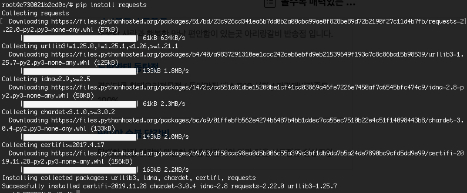
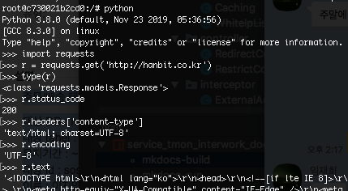
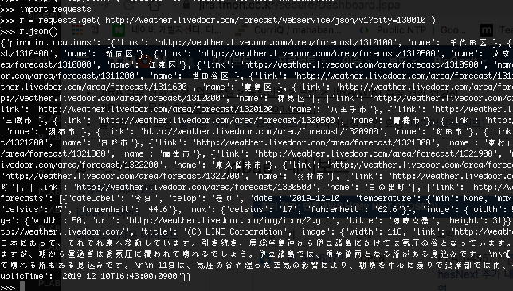
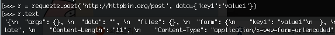

# 3.1 라이브러리 설치

* PyPI\(Python Package Index\) : 파이썬 패키지 리포지토리

## PIP 로 설치하기

```text
(scraping) $ pip install <라이브러리 이름>
```

버전을 지정해서 설치하는 것도 가능

```text
(scraping) $ pip install <라이브러리 이름>=1.0
```

모든 라이브러리의 버전을 확인 하고 싶은 경우

```text
(scraping) $ pip freeze
```

## 웹페이지 간단하게 추출하기

Requests 라이브러리를 설치합니다.

```text
(scraping) $ pip install requests
```



설치가 완료 되면 셸에서 동작을 테스트 해봅니다.



```text
# 셸 화면을 깨끗하게 하고 싶을 떄
import os
os.system('clear')
```

Response 객체에는 json\(\) 메서드가 있어서 JSON 형식의 응답을 간단하게 디코드에해서 추출할 수 있다.



Requests 에는 get\(\) 함수 이외에도 post\(\), put\(\), delete\(\), head\(\), options\(\) 함수가 있으며, 각각 HTTP메서드 POST, PUT, DELETE, HEAD, OPTIONS 에 대응합니다.

post\(\) 메서드로 전송 시 키워드 매개변수 data에 딕셔너리를 지정하면  HTML 입력 양식처럼 전송됩니다. 




