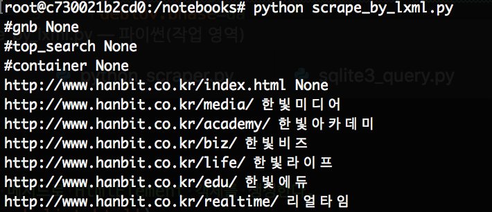
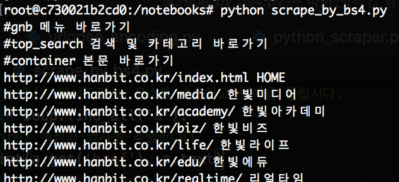

# 3.3 HTML 스크레이핑

## XPath 와 CSS 선택자

**XPath 선택자가** 조금 더 많은 기능으로 세부적인 조건을 지정할 수 있지만  
대부분의 경우에는 **CSS선택자**를 사용하는 것이 간편하고 쉽다.

## lxml로 스크레이핑하기

먼저 개발 전용 패키지를 설치합니다.

```bash
$ sudo apt-get update
$ sudo apt-get install -y libxml2-dev libxslt-dev libpython3-dev zlib1g-dev
```

lxml을 설치합니다.

```bash
$ pip install lxml
```

CSS 선택자를 사용할 것이므로 cssselect도 설치해 둡시다.

```bash
$ pip install cssselect
```

설치가 완료되면 wget 명령어로 실습에 사용할 full.book.list.html 을 내려받습니다.

```bash
$ wget http://www.hanbit.co.kr/store/books/full_book_list.html
```

lxml의 기본적인 사용법을 이해하고, 실제 사이트를 대상으로 스크레이핑 해봅니다.

```python
import lxml.html

# HTML파일을 읽어들이고, getroot() 메서드로 HtmlElement 객체를 생성한다.
tree = lxml.html.parse('full_book_list.html')
html = tree.getroot()

# cssselect() 메서드로 a 요소의 리스트를 추출하고 반복을 돌립니다.
for a in html.cssselect('a'):
    #href 속성과 글자를 추출합니다.
    print(a.get('href'), a.text)
```



## Beautiful Soup로 스크레이핑하기

```python
# 설치를 해봅시다
$ pip install beautifulsoup4
```

기본적인 사용법을 익힌 후 실제 사이트를 대상으로 스크레이핑 해봅시다

```python
from bs4 import BeautifulSoup

# HTML 파일을 읽어 들이고 BeautifulSoup 객체를 생성합니다.
with open('full_book_list.html') as f:
    soup = BeautifulSoup(f, 'html.parser')

# find_all() 메서드로 a 요소를 추춣하고 반복을 돌립시다.
for a in soup.find_all('a'):
    # href 속성과 글자를 추출합니다.
    print(a.get('href'), a.text)
```



