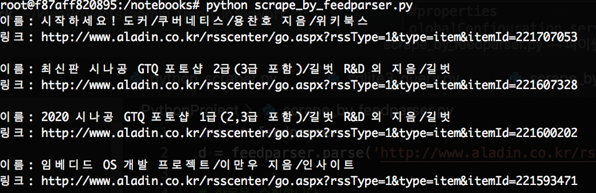

# 3.4 RSS 스크레이핑

feedparser 를 사용하면 표준라이브러리인 ElementTree보다 간단한 방법으로 RSS 피드에서 데이터를 추출할수 있습니다.

```text
$ pip install feedparser
```

```python
import feedparser
d = feedparser.parse('http://www.aladin.co.kr/rss/special_new/351')

# 항목을 순회합니다
for entry in d.entries:
    print('이름:', entry.title)
    print('링크:', entry.link)
    print()
```



