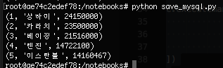
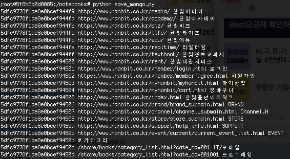

# 3.5 데이터베이스에 저장하기

* 데이터베이스에 저장하면 단순한 파일로 저장하는 것과 다르게 여러 개의 프로세스에서 동시에 읽고 쓰는 성능이 높다
* 데이터의 중복을 방지하기도 쉽다
* 데이터를 분석에 활용할 때 조건에 맞게 일부 데이터만을 추출하는 것도 쉽다.
* 관계형 데이터베이스
  * 관계모델과 트랜잭션을 기반으로 데이터의 정합성을 보
  * 표준화된 SQL 구문을 사용해 유연하게 데이터를 관
  * 대표 : MySQL
* NoSQL
  * 관계형 DB에 비해 데이터 정합성은 약함
  * 대신 확장성과 읽고 쓰기 성능이 굉장히 높음
  * 대표 : MongoDB

## MySQL에 데이터 저장하기

```bash
# 설치 후 실행 까지 완료
$ docker run --name=jg_mysql --env="MYSQL_ROOT_PASSWORD=root_password" -p 3306:3306 -d mysql:latest

# mysql docker 컨테이너 접속하기
$ docker exec -it jg_mysql mysql -uroot -proot_password

mysql> create database scraping default character set utf8mb4;
Query OK, 1 row affected (0.14 sec)

# 최신 mysql에서 암호화 방식이 기 caching_sha2_password 로 바뀌었다.
# 이전 버전 암호화 방식으로 바꿔준다.
mysql> create user `scraper`@`%` IDENTIFIED BY 'password';
Query OK, 0 rows affected (0.10 sec)


mysql> grant all on scraping.* to scraper;
Query OK, 0 rows affected (0.03 sec)
```

## 파이썬에서 MySql에 접속하기

```bash
# 추후 필요한 개발 전용 패키지인 default-libmysqlclient-dev 를 설치
$ apt-get install -y default-libmysqlclient-dev

# 사용하기 쉽고 성능도 좋은 mysqlclient 설치
$ pip install mysqlclient

```

파이썬에서 MYSQL에 접속하고 데이터를 저장하는 스크립트

```bash
import MySQLdb

# MySQL 서버에 접속하고 연결을 변수에 저장합니다.
# 사용자 이름과 비밀번호를 지정한 뒤 scraping 데이터베이스를 사용(USE) 합니다.
# 접속에 사용할 문자 코드는 utf8mb4로 지정합니다.
conn = MySQLdb.connect(host='jg_mysql', db='scraping', user='scraper', passwd='password', charset='utf8mb4', use_unicode='true')

# 커서를 추출합니다.
c = conn.cursor()

# execute() 메서드로 SQL 구문을 실행합니다.
# 스크립트를 여러 번 사용해도 같은 결과를 출력할 수 있게 cities 테이블이 존재하는 경우 제거합니다.
c.execute('DROP TABLE IF EXISTS cities')
# cities 테이블을 생성합니다.
c.execute("""
    CREATE TABLE cities (
        `rank` integer,
        `city` text,
        `population` integer
    )
""")

# execute() 메서드의 두 번째 매개변수에는 파라미터를 지정할 수 있습니다.
# SQL 내부에서 파라미터로 변경할 부분(플레이스홀더)은 %s로 지정합니다.
c.execute('INSERT INTO cities VALUES (%s, %s, %s)', (1, '상하이', 24150000))

# 파라미터가 딕셔너리일 때는 플레이스홀더를 %(<이름>)s 형태로 지정합니다.
c.execute('INSERT INTO cities VALUES (%(rank)s, %(city)s, %(population)s)',
            {'rank':2, 'city':'카라치', 'population':23500000}
)

# executemany() 메서드를 사용하면 여러 개의 파라미터를 리스트로 지정해서
# 여러 개(현재 예제에서는 3개)의 SQL 구문을 실행할 수 있습니다.
c.executemany('INSERT INTO cities VALUES (%(rank)s, %(city)s, %(population)s)', [
            {'rank':3, 'city':'베이징', 'population':21516000},
            {'rank':4, 'city':'텐진', 'population':14722100},
            {'rank':5, 'city':'이스탄불', 'population':14160467}
])

# 변경사항을 커밋(저장) 합니다.
conn.commit()

# 저장한 데이터를 추출합니다.
c.execute('SELECT * FROM cities')
# 쿼리의 결과는 fetchall() 메서드로 추출할 수 있습니다.
for row in c.fetchall():
    # 추출한 데이터를 출력합니다.
    print(row)

# 연결을 닫습니다.
conn.close()
```



## MongoDB에 데이터 저장하기

NoSQL의 일종으로, 문서형이라고 부르는 데이터베이스

오프소스 소프트웨어로 공개되어 있으며, 유연한 데이터 구조, 높은 쓰기 성능, 사용하기 쉬움

```bash
# 기존 컨테이너를 모두 제거한다.

# 도커 네트워크를 만든다. --link 옵션은 레거시 옵션으로 곧 없어진다.
$ docker network create jg_network

# 몽고DB 컨테이너를 만든다.
$ docker run --name jg_mongo -d --network jg_network -p 27017:27017 mongo

# mysql 컨테이너를 만든다.
$ docker run --name=jg_mysql --network jg_network --env="MYSQL_ROOT_PASSWORD=root_password" -p 3306:3306 -d jg_mysql

# mypy 컨테이너를 만든다.
$ docker run --name mypy --network jg_network -it -v /Users/jgbae/PythonProject:/notebooks mypy /bin/bash
```

MongoDB에 스크레이핑으로 추출한 데이터를 저장하는 스크립트

```bash
import lxml.html
from pymongo import MongoClient

# HTML 파일을 읽어 들이고
# getroot() 메서드를 사용해 HtmlElement 객체를 추출합니다.
tree = lxml.html.parse('full_book_list.html')
html = tree.getroot()

client = MongoClient('jg_mongo', 27017)
db = client.scraping    # scraping 데이터베이스를 추출합니다.
collection = db.links   # links 콜렉션을 추출합니다.

# 스크립트를 여러 번 사용해도 같은 결과를 출력할 수 있게 콜렉션의 문서를 제거합니다.
collection.delete_many({})

# cssselect() 메서드로 a 요소의 목록을 출력합니다.
for a in html.cssselect('a'):
    if a.text:
        # href 속성과 링크의 글자를 추출해서 저장합니다.
        collection.insert_one({
            'url' : a.get('href'),
            'title' : a.text.strip(),
        })

# 콜렉션의 모든 문서를 _id 순서로 정렬해서 추출합니다.
for link in collection.find().sort('_id'):    
    print(link['_id'], link['url'], link['title'])
```




